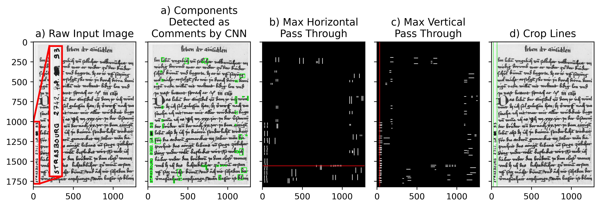

# Annotation Remover for ICDAR 2017 ClaMM Dataset

- A classifier was trained to crop out handwritten annotations in the ClaMM 2016 [1] and 2017 [2] datasets. 

- CNN Model is adapted from [3].

- Trained on 28 images from the 2016 dataset.

## References

[1] Cloppet, F., Eglin, V., Stutzmann, D., & Vincent, N. (2016, October). ICFHR2016 competition on the classification of medieval handwritings in latin script. In 2016 15th International Conference on Frontiers in Handwriting Recognition (ICFHR) (pp. 590-595). IEEE.

[2] Cloppet, F., Eglin, V., Helias-Baron, M., Kieu, C., Vincent, N., & Stutzmann, D. (2017, November). Icdar2017 competition on the classification of medieval handwritings in latin script. In 2017 14th IAPR International Conference on Document Analysis and Recognition (ICDAR) (Vol. 1, pp. 1371-1376). IEEE.

[3] Ahamed, P., Kundu, S., Khan, T., Bhateja, V., Sarkar, R., & Mollah, A. F. (2020). Handwritten Arabic numerals recognition using convolutional neural network. Journal of Ambient Intelligence and Humanized Computing, 11, 5445-5457.